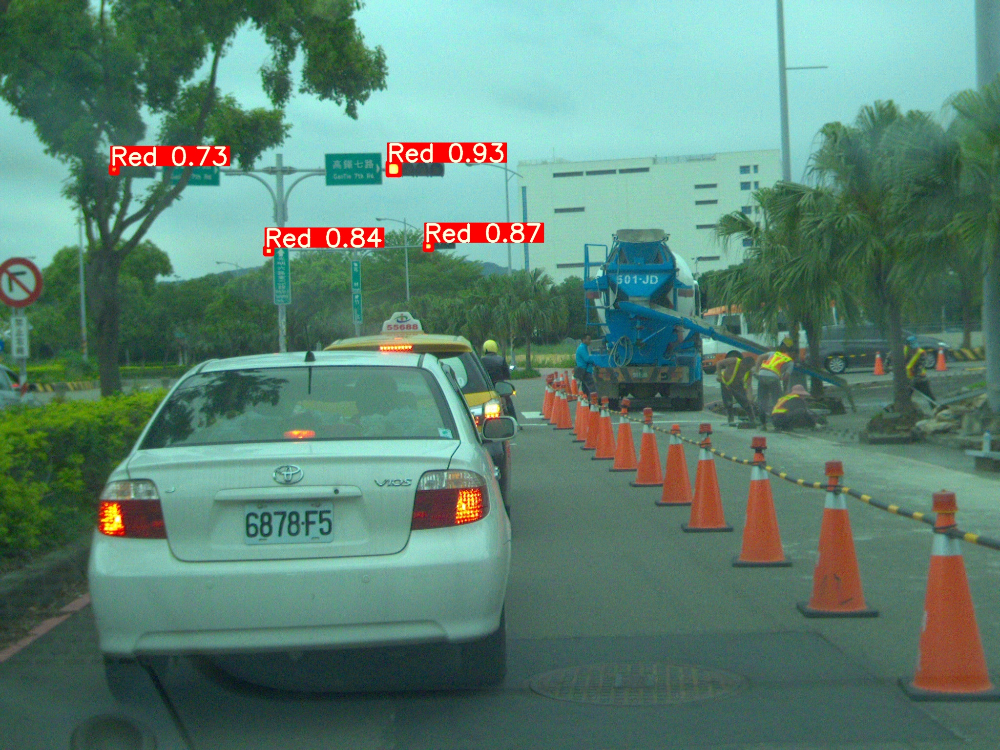

# yolov7_traffic_light_detect

## Installation
Create new environment in anconda: 

```anconda
 conda create -n name python=version 
 conda activate name 
 pip install -r requirements.txt 
```


## Testing 

We have three weights in first stage and one weight in second stage.<br>
[Download weights!](https://drive.google.com/drive/folders/1T3CyOxqVJ_0Ip9x9dUU6hf9qo6b485uD?usp=drive_link)

```python
## First Stage
# Use a weight:
python test_TL.py --data data/TL_3cls.yaml --weights (your_weights_path)/FristStage_model1_3cls.pt --img-size 1280 --batch-size 8 --task test  --name (dir_name)

# Use three weights(ensemble learning):
python test_TL.py --data data/TL_3cls.yaml --weights (your_weights_path)/FristStage_model1_3cls.pt (your_weights_path)/FristStage_model2_3cls.pt (your_weights_path)/FristStage_model3_3cls.pt --img-size 1280 --batch-size 8 --task test --no-trace --name (dir_name)

## Second Stage
# You need to crop the TL from First Stage result and label it as 7 cls.
# You can use data_tool.py crop_img() to help.
python test_TL.py --data data/TL_7cls.yaml --weights (your_weights_path)/SecondStage_7cls.pt --img-size 640 --batch-size 8 --task test  --name (dir_name)
```

## Training

```python
python train.py --data data/TL_3cls.yaml --batch-size 8 --epoch 400 ---weights '' --cfg cfg/training/yolov7.yaml --name (dir_name)
```

## Augment
1. You can get HSV analysis results from data_tool.py comp_TPFP()
   ```python
   # You need to change the following parameters
   img_path = 'your_test_image_path',
   txt_path = 'your_test_result_path',
   out_path = 'output_path'
   ```
3. Augment the training set from data_tool.py augment_train()
   ```python
   # After running 1, you can get the hsv parameters form /runs/test/(test_dir_name)/BGR_HSV.txt.
   # hsv = FN_HSV-TP_HSV
   # You need to change the following parameters
   train_img = 'your_training_set_path/train.txt',
   hsv = [[3.0, -115.0, -17.0], [4.0, -23.0, -33.0], [4.0, -109.0, -1.0]], #Red, Yellow, Green
   save_path = os.path.join(Path(img).parents[1], '(yout_augment_dir_name)','JPEGImages'),
   
   # your txt name needs to be the same as the image name
   shutil.copy(txt_path,os.path.join(txt_save_path,'1_'+name+'.txt'))' .
   cv2.imwrite(os.path.join(save_path,'1_'+name),cv2.cvtColor(ex_img[0],cv2.COLOR_HSV2BGR))
   ```

## Inference 
```python
python detect_twonet.py --site-weights (your_weights_path)/FristStage_model1_3cls.pt (your_weights_path)/FristStage_model2_3cls.pt (your_weights_path)/FristStage_model3_3cls.pt --state-weights (your_weights_path)/SecondStage_7cls.pt --source (your_test_img_path)/images --no-trace --img-size 1280 --name (dir_name) 
```

